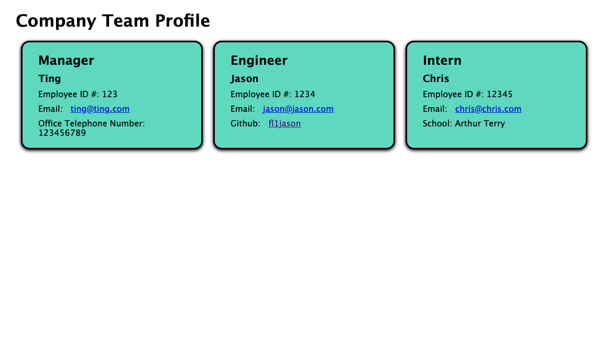

# Week-10-Challenge-Team-Profile-Generator

## Description
This week's challenge was to build a Node.js command-line application that takes in information about employees on a software engineering team, then generates an HTML webpage that displays summaries for each person.

Some of the technologies used for this challenge: 
* inquirer
* jest

## Screenshot

## Video link
https://watch.screencastify.com/v/lK3m6dwEoMKDNs8bOQ9D
